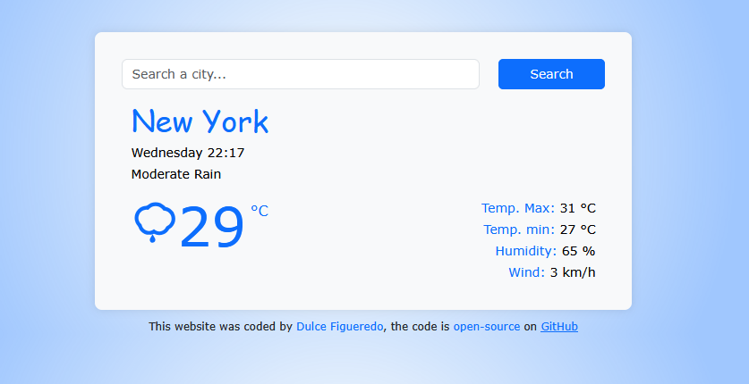

## 📍 React Weather App

  💻 This is a web application developed with React that allows users to check the current weather of any city through an interactive 🔎 search bar. By entering the city name, the app displays relevant meteorological information such as current temperature, maximum and minimum temperatures, humidity, wind speed, and a brief weather description, all presented in a simple and user-friendly interface.  
  👉🏽 The project integrates API consumption to obtain real-time data and is designed to be intuitive and easy to use, making it ideal for practicing external service integration and state management in React.    

  💡 The app was built with React.js, HTML, CSS and Current weather data API.  
  The web app is hosted on <a href="https://dulce-react-weather.netlify.app/">Netlify</a>

  

### Weather app 🌦

